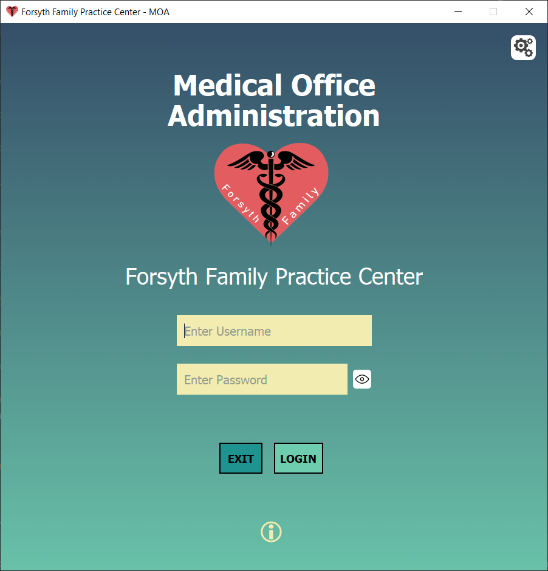

# Medical Office Administration Program



## Warning
Project is no longer functional due to missing database

## Information 
 This capstone project is a proof of concept for a office scheduling software for a fictional clinic. We completed this project over the course of 15 weeks at Forsyth Techenical College. The projected is no longer fully functioning due to a missing database that was shared between our group and other groups in our capstone. We used QT Designer to create our front-end and SQLAlchemy for our backend. 

## Features 
 - Set and Cancel Appointments
 - Check-In/Check-Out A Patients Appointment
 - Approve Appointments from the Web Portal
 - Make Referrals
 - Make Lab Orders

## Run From Source
Install the requirements.txt
```powershell
python -m pip install -r requirements.txt
```
Then run the run file.
```powershell
python run.py
```
You should either source all your files from run.py or use this to test everything.

## Building From Source
 In Powershell
 ```powershell
  git clone https://github.com/mxrked/Medical-Office-Administration/
 ```
 ```powershell
  cd .\Medical-Office-Administration\
 ```
 ```
 .\build.bat
 ```
 A link is created in Medical Office Administration.


## Installer
 Alternatively you can use our setup installer that will be available at project completion

## Credits
 - Parker Phelps (Project Owner)
 - Christina Fortin (Scrum Master)
 - Jessica Weeks (QA Developer)
 - Flora Cherotich (Database Technician)
 - Destan Hutcherson, Matthew Burrus (Program Analyst)
