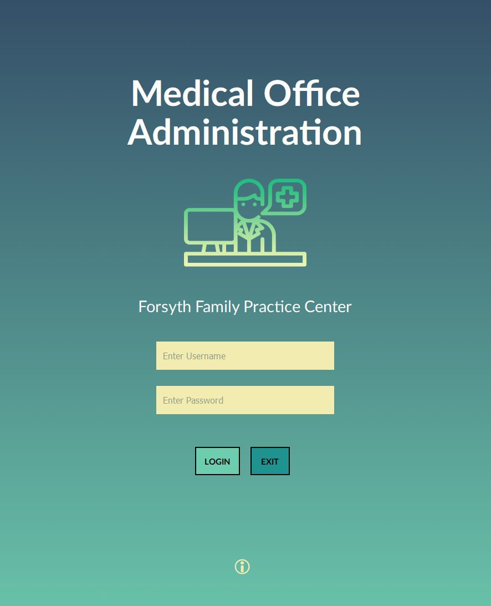

# Medical Office Administration Program



## Features 
 - Set and Cancel Appointments
 - Check-In/Check-Out A Patients Appointment
 - Approve Appointments from the Web Portal
 - Make Referrals
 - Make Lab Orders

## Building From Source
In Powershell
 ```powershell
  git clone https://github.com/mxrked/Medical-Office-Administration/
 ```
 ```powershell
  cd .\Medical-Office-Administration\
 ```
 ```
 .\build.bat
 ```
A link is created in the directory

## How to Use
 - Pending project completion

## Credits
 - Parker Phelps (Project Owner)
 - Christina Folin (Scrum Master)
 - Jessica Weeks (QA Developer)
 - Flora Cherotich (Database Technician)
 - Destan Hutcherson, Matthew Burrus (Program Analyst)
 - Adia Chue (Web Developer)
